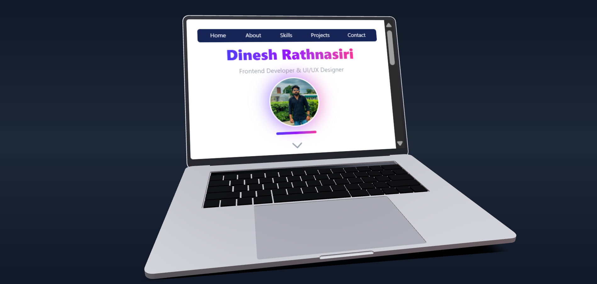

<h1 align="center">🌐 3D Portfolio Website</h1>  

<p align="center">
  <i>A modern interactive portfolio built with 3D graphics, animations, and responsive design.</i>  
</p>  

<p align="center">
  
  
  
  
</p>  

---

## 🎥 Demo  

[](./public/protfoliyoDemo.mp4)  
*(Click the image to watch the demo video)*  

🔗 **Live Website:** [dineshrathnasiri.netlify.app](https://dineshrathnasiri.netlify.app/)  

---

## ✨ Features  

- 🎨 Immersive **3D environment** using Three.js + React Three Fiber  
- 💻 Realistic **Laptop Model** displaying my work/projects  
- ⚡ Responsive **Tailwind CSS design**  
- 📱 Optimized for **Mobile & Tablet**  
- 🧑‍💼 Dedicated **Projects showcase** with GitHub & Live links  
- 🖼️ Custom **3D logo & hacker room** environment  

---

## 🛠️ Tech Stack  

**Frontend:**  
  
  
  

**3D & Graphics:**  
  
  
  

**Deployment:**  
  

---

## ⚡ Quick Start  

```bash
# Clone the repo
git clone https://github.com/your-username/3d-portfolio.git

# Go to folder
cd 3d-portfolio

# Install dependencies
npm install

# Run development server
npm run dev
